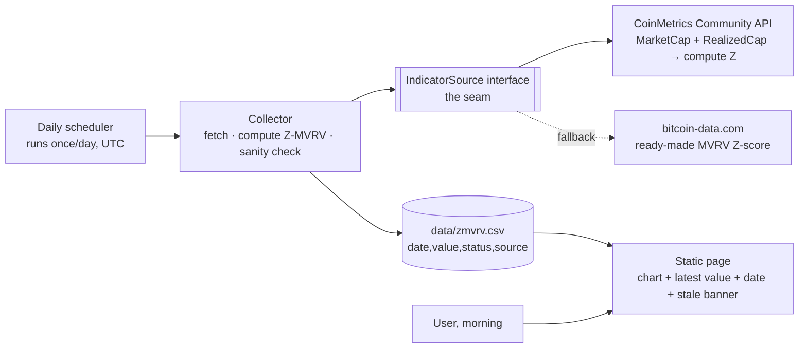

# Design Doc (TRD) — BTC Cycle Dashboard · Z-MVRV 한 장짜리 대시보드

**Status:** Draft  ·  **Author (owner):** <you> · **Reviewers:** <mentor> ·
**Related:** PRD → `PRD-bitcoin-dashboard.md` (v2, Z-MVRV-only MVP) · ADRs: `ADR-001`…`ADR-004` (derived from §6 D1–D4) ·
**Last updated:** 2026-08-28

> **Reading guide for a non-developer owner.** Every decision below is written as **A vs B (vs C)**
> with the trade-off spelled out, then a **DECISION** line. If a decision line says *"verify first"*,
> it means the choice hinges on a fact we must check by hand before building.

---

## 1. Context & Summary
Implements `PRD-bitcoin-dashboard.md` v2: **one chart (Z-MVRV), refreshed once a day from free
data, never showing a stale or wrong number as if it were today's.**

Shape of the solution: **a tiny two-part system.**
1. A **daily collector** that wakes up once a day, fetches the raw numbers, computes Z-MVRV,
   sanity-checks it, and appends one row to a small data file.
2. A **static web page** that reads that file and draws the chart. No server is running when
   nobody is looking.

**The key seam → `IndicatorSource`.** The page never knows *where* the number came from. It only
reads rows of `(date, value, status)`. The collector is the only thing that knows about
CoinMetrics / bitcoin-data.com / whoever. Swapping a data source — the single most likely
change in this project — touches one file and nothing else. Adding Hash Ribbon in Phase 2
= adding one more collector, same shape.

## 2. Goals & Non-Goals
**Design goals**
- A morning open shows the chart in **< 3 s** with the latest-data date visible (PRD §8: < 10 s
  end-to-end, so budget most of it for a slow phone network).
- **Zero running cost** and **zero always-on servers**: nothing to pay for, nothing to keep alive.
- The collector is **idempotent** — running it twice on the same day produces the same one row,
  not two. (This is what makes "just rerun it" a safe fix when something breaks.)
- Every row carries a **status** (`ok` / `suspicious` / `missing`) so the page can render the
  PRD §7 states without guessing.
- Source isolated behind `IndicatorSource`; adding Phase 2 indicators means new collectors, not
  a redesign.

**Design non-goals (this doc)**
- Accounts, multi-user, public traffic (PRD §5 Phase 4).
- Any real-time or intraday path (PRD §5 out of scope).
- Alerts/notifications (PRD §5 Phase 3) — but the `status` column and daily run are shaped so
  an alert is a ~10-line addition later.
- A database. A file is enough for ~1 row/day (see §6 D3).

## 3. Architecture

- **Daily scheduler** — a free scheduled job (see §6 D2). Fires once per UTC day after the
  on-chain day has closed. Nothing else in the system is "on".
- **Collector** — one script. Steps: ① ask `IndicatorSource` for today's value, ② compare with
  yesterday's (sanity rule §4), ③ write one row, ④ if anything fails, write a `missing` row
  with the error text so the failure is *visible*, not silent (PRD guardrail).
- **★ The seam — `IndicatorSource`** — `getLatest() → {date, value, sourceName}`. Two
  implementations: primary (compute from CoinMetrics) and fallback (ready-made from
  bitcoin-data.com). The collector tries primary, then fallback, and records *which one* it used.
- **Data file** — one CSV, append-only, committed alongside the page. History and audit trail
  in one place; "why does this day look weird?" is answered by the file's change history.
- **Static page** — HTML + own canvas chart (ADR-004). Reads the CSV, draws, shows the latest row big,
  and turns the top banner yellow/red based on `status` and row age.

## 4. Data & API Design
- **Data model** — single file `data/zmvrv.csv`:

  | column | meaning |
  |---|---|
  | `date` | UTC day the value belongs to (`YYYY-MM-DD`) |
  | `value` | Z-MVRV, 2 decimals; empty when `missing` |
  | `status` | `ok` · `suspicious` (jump rule tripped) · `missing` (fetch failed) |
  | `source` | which `IndicatorSource` produced it (`coinmetrics` / `bitcoindata`) |
  | `note` | error text or reason for `suspicious`; usually empty |

- **Z-MVRV definition (reference, fixes PRD §9 "definition drift"):**
  `Z = (MarketCap − RealizedCap) / stdev(MarketCap over all history)`
  — the Glassnode/awe&wonder formula using the **full-history** standard deviation. Written down
  once here; the accuracy check in PRD §8 compares against a site using this same formula.
- **Sanity rule (PRD §6 "implausible jump"):** mark `suspicious` if `|today − yesterday| > 0.5`
  or if the value is outside `[-1.5, 12]`. Numbers are a starting point — tune against the
  historical series after first load (PRD §9 open question).
- **Staleness rule (PRD §7 time zone):** a row is *fresh* if `date ≥ today_UTC − 1`. The page
  shows a yellow "no update yet" banner at 2 days, red "stale since <date>" at 3+ days.
- **API:** none. The page fetches one static file. (Adding a public API is a Phase 4 concern.)

## 5. Non-Functional Requirements
- **Security:** no secrets in the page (it is static; anything in it is public). If a source ever
  needs an API key, it lives only in the scheduler's secret store, used by the collector.
- **Rate limiting / cost:** 1–2 requests per day per source — orders of magnitude under any free
  tier. Cost target **$0/month** (PRD §8).
- **Performance:** CSV stays < 100 KB for 10 years of daily rows; chart render < 1 s on a phone.
  Measure once, then stop worrying.
- **Observability:** the CSV *is* the log. Plus: the scheduled job's own run history (green/red
  per day) — check it when the page shows a `missing` row.
- **Scale:** one user, one static file. Scales to Phase 4 by putting a CDN in front, unchanged.
- **Failure mode (the PRD guardrail, made concrete):**
  - Primary source down → fallback source, row tagged `source=bitcoindata`.
  - Both down → `missing` row written; page keeps last good chart, banner says why.
  - Value looks wrong → `suspicious` row; plotted in a different color, previous value shown next
    to it; not silently trusted.
  - Scheduler itself doesn't fire → no new row → page's age rule turns the banner yellow then red.
    **This is the one failure the system cannot log about itself**, which is exactly why staleness
    is computed from row age on the page, not from a "last run" flag.

## 6. Alternatives Considered (→ ADRs)

### D1 — Where does the Z-MVRV number come from? ★ make-or-break (PRD §9)
| | **A. Compute it ourselves** from CoinMetrics Community (free) MarketCap + RealizedCap | **B. Ready-made Z-score** from a free aggregator (bitcoin-data.com) | **C. Pay** for Glassnode/CryptoQuant |
|---|---|---|---|
| Cost | $0 | $0 | ~$30–40/mo |
| Trust | High — reputable source, formula is ours and documented | Medium — small site, could vanish or change formula silently | Highest |
| Breakage risk | Low (stable, versioned API) | Medium–high | Low |
| Effort | +1 day: fetch two series, compute stdev | Lowest: one request | Lowest |
| Terms for Phase 4 (public) | Community terms allow non-commercial use; **verify** before Phase 4 | Unclear; **verify** | Redistribution typically forbidden |

**DECISION: A primary, B fallback. C rejected** — it defeats the PRD's whole reason to exist.
*Trade-off accepted:* one extra day of work (computing stdev over full history) buys
independence from a small site and a formula we control. *Verify first:* that CoinMetrics
Community still exposes `CapRealUSD` for free with daily granularity — a 10-minute check
before any code is written. If it doesn't, flip to B primary and raise the PRD §9 payment
ceiling question immediately.

### D2 — What runs the collector once a day?
| | **A. GitHub Actions scheduled workflow** | **B. A small always-on server** (VPS / Raspberry Pi) | **C. Serverless cron** (Cloudflare Workers / Vercel cron) |
|---|---|---|---|
| Cost | $0 (public repo) | $5/mo or a device to babysit | $0 tier, but function limits |
| Ops burden | None — GitHub keeps it alive | Highest — updates, uptime, power | Low |
| Output lands where the page is | **Yes** — commit the CSV to the same repo | Needs a separate publish step | Needs storage + publish step |
| Known weakness | Scheduled runs can be delayed minutes–hours; run history is visible | — | Vendor-specific config |

**DECISION: A.** *Trade-off accepted:* the run may fire late (GitHub doesn't guarantee the
minute) — irrelevant for a once-a-day glance, and the page's age-based banner covers the
"it never fired" case (§5). Collector *and* data *and* page live in one repo = one thing to
understand.

### D3 — Where is the history stored?
| | **A. CSV file in the repo** | **B. SQLite file** | **C. Hosted DB (Supabase etc.)** |
|---|---|---|---|
| Fits ~365 rows/yr | Trivially | Yes | Massive overkill |
| Human-readable / editable by hand | **Yes** (fix a bad row in a text editor) | No | No |
| History of changes | Free via git | No | No |
| Phase 2 (4 indicators) | 4 files or 4 columns — fine | Fine | Fine |
| Phase 4 (many users) | Fine — it is read-only static data | Fine | Only needed if users *write* data |

**DECISION: A.** *Trade-off accepted:* no queries — but there is nothing to query; the page
reads the whole file. Revisit only if users ever write their own data (Phase 4+).

### D4 — How is the page built?
| | **A. Single static HTML + a chart library** (no framework, no build step) | **B. React/Next app** |
|---|---|---|
| Effort to first chart | Hours | Days |
| Fits owner's skill level | Yes — one file, readable top to bottom | Steep |
| Phase 2 (4 charts) | Copy the chart block ×4 — fine | Better structure, but not needed |
| Hosting | GitHub Pages, free | Needs a build pipeline |

**DECISION: A**, same reasoning that worked for ParkHere. *Trade-off accepted:* if the page
grows past ~6 charts with interactions, a framework will earn its keep — that is a Phase 2+
decision, not now.

### D5 — Compute Z-MVRV daily from scratch vs. incrementally?
- **A. Recompute from full history every run** — simple, correct, ~1 s of work.
- **B. Keep a running stdev** — faster, but a bug silently drifts forever.

**DECISION: A.** Correctness over a second of CPU once a day.

## 7. Risks & Dependencies
- **★ D1 verify-first.** If CoinMetrics Community no longer provides realized cap, the primary
  path is dead before it starts. Check on day 1, before writing code.
- **Fallback formula mismatch.** bitcoin-data.com may use a different stdev window → a
  fallback day's value could differ by ±0.2 from the primary. Mitigation: `source` column makes
  it visible; plot fallback days in a lighter color.
- **Silent format change** (PRD §7): a source starts returning millions instead of units →
  caught by the `suspicious` range rule, *not* plotted.
- **GitHub Actions schedule auto-disable**: scheduled workflows on inactive repos get
  auto-disabled after 60 days of no commits — but the collector commits daily, so it stays
  active. Worth knowing.
- **Terms of use** (PRD §9): personal use is fine for both sources; **public** re-display is
  not confirmed. Blocks Phase 4, not MVP.
- **Depends on:** CoinMetrics Community API · bitcoin-data.com · GitHub (Actions + Pages) ·
  a chart library (choice → tiny ADR when picked; candidates: Chart.js, uPlot, Plotly).

## 8. Rollout / Phasing
| Stage | What lands | Go-live bar (must pass to advance) |
|---|---|---|
| **W1 — Verify** | Manual check of D1 (does the free data exist?); this doc + PRD approved | Realized cap fetched by hand once, value computed on paper matches a reference site within ±0.1 |
| **W2 — Backfill** | Collector computes full history offline; CSV committed; page draws it | Chart shape visually matches the reference site for 2020–today |
| **W3 — Shadow** | Daily scheduled run live, **page not yet relied on** — still check the old site too | 7 consecutive daily rows, all `ok`, each within rounding of reference |
| **W4 — Live** | Stop checking the old site; page is the morning source | 30-day PRD §8 reliability bar: ≥ 28/30 fresh, zero silent failures |
| **Phase 2** | Add Hash Ribbon / ETF / stablecoin as new `IndicatorSource`s | Each one repeats W2→W3 individually before joining the page |

*Why shadow before live:* the guardrail is "never a wrong number as if it is today's." One
week of running side-by-side with the paid site is the cheapest way to earn that trust — and
it is the last week you will ever open the paid site.
